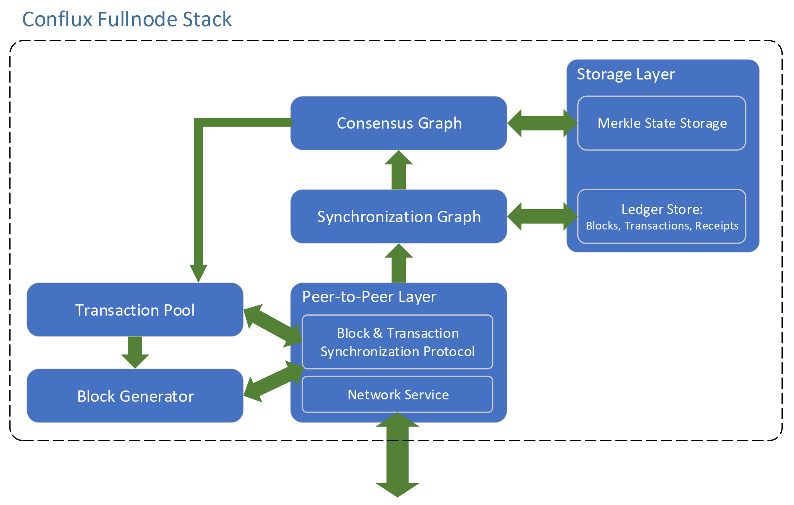

# Conflux设计文档
在本文档中，我们描述了Conflux软件栈的架构和组织结构及其对应的设计原理。下图展示了Conflux全节点栈的概况。

由几个关键部分组成。

* 点对点层：Peer-to-Peer Layer
* 同步图：Synchronization Graph
* 共识图：Consensus Graph
* 存储层：Storage Layer
* 交易池：Transaction Pool
* 区块生成器：Block Generator

一般来讲，点对点层负责在整个网络节点之间传播区块和交易，每个节点与其对等节点保持若干个入站/出站连接。
每个节点同时维护一个内存中的同步图数据结构。当对等节点收到一个区块或在本地生成一个新区块时，该区块将首先被插入到同步图并在其中进行一些基本的验证，这类验证不需要图相关的信息。
当一个区块进入同步图时，其过去设置的块可能还没有进入。
同步图负责监控区块，并在所有过去设置的区块进入同步图后，将其放入到共识图内。
当区块进入共识图时，其过去设置的区块也应当进入该图。
随后针对新到达区块执行共识算法以相应调整区块的总体顺序。共识图组件执行新到达的区块，并更新存储层内的账户状态。

每个节点都维护着一个交易池，该交易池保持着待打包的交易，并将交易转发至可能需要它们的对等节点处。
区块生成器组件驱动挖矿工作，从交易池内选取交易并将其打包到新生成的区块中。

本文件分为以下几节:

* [共识机制](consensus-cn.md)
* [区块同步过程](sync-cn.md)
* [交易中继](trans-cn.md)

