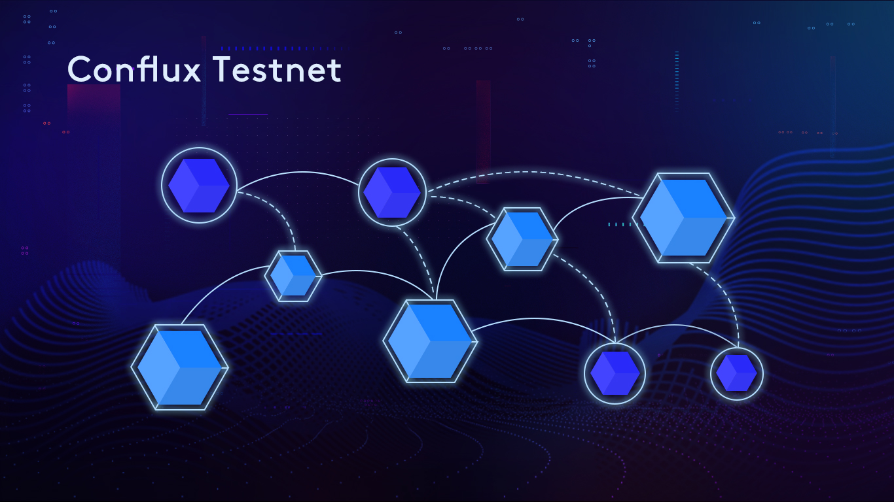

# 欢迎来的Conflux

**Conflux testnet 已经上线了！**

我们很高兴地宣布Conflux testnet的发布，为开发者和用户提供早期接触该技术的机会。

[Conflux](https://www.conflux-chain.org/) 是新一代基于PoW的公有区块链系统，可以达到每秒数千笔交易的吞吐量和几分钟内的交易确认延迟。之所以实现如此之高性能的关键点是其基于 **树图** 结构的共识机制。

在这个testnet版本中，主要的特性包括：

- 基于树-图的共识机制
- 基于默克尔树认证的账户状态存储功能
- 用于与全节点交互的JavaScript和Json-RPC的应用程序接口
- 与Solidity兼容的智能合约 
- ConfluxScan-区块链浏览器
- 一款基于网页的Conflux钱包
