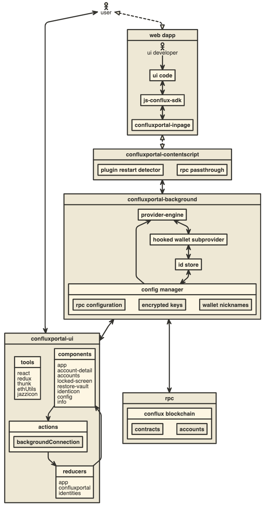

# 移植ConfluxPortal到新环境的指引

ConfluxPortal已经持续开发了近一年时间。我们也在逐渐发现一些有用的抽象方便我们更容易的成长。这几层想法结合起来，可以让ConfluxPortal越来越容易移植到新的环境和语境中（尽管它可以更容易，但如果您卡住了，请联系我们！）。

在我们开始之前，我们的基础架构是值得去熟悉的。



`ConfluxPortal-background` 描述了位于路径 `app/scripts/background.js` 下的Web扩展单例文件，该上下文会实例化了一个 `ConfluxPortal Controller` 实例，能够代表用户的账户，与区块链网络的连接以及与新Dapp的交互。

当访问新站点时，WebExtension会在页面上下文中创建一个可以在`app/scripts/contentscript.js` 中看到的新 `ContentScript` 。该脚本表示每页的设置过程：为每个页面创建 `web3` 应用程序接口，并通过移植API(封装在[stream abstraction](https://github.com/substack/stream-handbook)中)
与后端脚本建立连接，并在任意加载前注入到DOM中。

你可以选择使用该流接口连接ConfluxPortal控制器，通过连接[confluxportal-inpage-provider](https://github.com/yqrashawn/conflux-portal-inpage-provider#readme)可以在流中包裹任何传输内容。但你也可以像这样为每个域构建一个提供商：

```javascript
const providerFromEngine = require('@yqrashawn/cfx-json-rpc-middleware/providerFromEngine')

/**
* returns a provider restricted to the requesting domain
**/
function incomingConnection (domain, getSiteMetadata) {
  const engine = confluxPortalController.setupProviderEngine(domain, getSiteMetadata)
  const provider = providerFromEngine(engine)
  return provider
}
```

请注意如果采取这种方式，你需要负责在页面关闭时清空过滤器：

```
const filterMiddleware = engine._middleware.filter(mid => mid.name === 'filterMiddleware')[0]
filterMiddleware.destroy()
```

### getSiteMetadata()

该方法用于使用代表请求域的图像和文本信息增强我们的确认屏幕。

这应该返回一个用对象解析的承诺，且该对象具有如下属性：

- `name`：请求的站点名；
- `icon`：代表站点标志的URI。

### 使用流接口

只有当你打算构建[confluxportal-inpage-provider](https://github.com/yqrashawn/conflux-portal-inpage-provider#readme)时才使用它。

关于将Confluxportal移植到新平台上的情况，最令人困惑的就是我们提供[js-conflux-sdk](https://github.com/Conflux-Chain/js-conflux-sdk#readme)应用程序接口的方式，该接口通过在一系列上下文之间的流实现。一旦你理解了我们如何在[inpage.js script](../app/scripts/inpage.js)中创建[ConfluxportalInpageProvider](https://github.com/yqrashawn/conflux-portal-inpage-provider#readme)时，就能理解为何[extension-port-stream](https://github.com/MetaMask/extension-port-stream)仅仅是[Port postMessage API](https://developer.chrome.com/extensions/runtime#property-Port-postMessage)的轻量级封装（可以查看 [Chrome扩展消息传递文档](https://developer.chrome.com/extensions/messaging#connect)以获取更多信息）。一个类似的流应用开发接口可以通过 `setupUntrustedCommunication(stream, domain)` 方法封装任何通道以便和 `ConfluxPortalController` 联系。

### ConfluxPorta控制器

ConfluxPortal的核心功能都依赖于我们所说的[ConfluxPortal控制器](https://github.com/Conflux-Chain/conflux-portal/blob/master/app/scripts/metamask-controller.js)组件。我们的目标是希望该文件最终可以作为Javascript模块导入到任何与JS兼容的上下文中，并允许其完全管理一个应用与Conflux之间的关系。

#### 构造器

当调用 `new ConfluxPortal(opts)` 时，许多特定平台的选项被配置。 `opts` 中的关键字如下所示：
- initState：最后一次发出的状态，用于恢复会话间的永久状态。
- platform： `platform` 对象定义了一系列针对特定平台的函数，包括打开确认视图和打开网站。
- 加密机 - 一个提供访问所需加密方法的对象。

##### 加密机

一个提供了2个简单方法的对象，支持按你需要的任何格式加密。该参数是可选的，默认使用浏览器原生的WebCrypto应用程序接口。

- encrypt(password, object) - 返回一个已经准备好存储的字符串格式的Promise。
- decrypt(password, encryptedString) - 允许传入 `encrypt` 加密处理过的输出，返回一个恢复后的Promise对象，因为输入是被加密过的。


##### 平台选项

`platform`对象拥有多个选项：

- reload (function) - 在ConfluxPortal希望重新加载其上下文时调用。
- openWindow ({ url }) - 在ConfluxPortal希望打开一个网页时调用。传递一个带有键值为 `url` ，对应值是字符串的单一 `options` 对象。
- getVersion() - 返回当前ConfluxPortal的版本，会在 `CHANGELOG-cn.md` 或 `app/manifest.json` 中描述。

#### [confluxportal.getState()](https://github.com/Conflux-Chain/conflux-portal/blob/master/app/scripts/metamask-controller.js#L450)

该方法返回一个JavaScript对象以表示ConfluxPortal的当前状态。包括已知账户、发送交易、当前汇率等信息！控制器同样也是事件发生器，所以你可以通过 `confluxportal.on('update', handleStateUpdate)` 订阅状态更新信息。

状态样例[在此](https://github.com/Conflux-Chain/conflux-portal/tree/develop/development/states)内容中的 `confluxportal` 键下提供。（警告：有些已经过时）

#### [confluxportal.getApi()](https://github.com/Conflux-Chain/conflux-portal/blob/develop/app/scripts/metamask-controller.js#L467-L718)

返回一个填充有表示用户接口曾经执行的每个操作的回调函数。通过这些应用程序接口方法，可以提供从创建新账户、更改当前网络到发送一笔交易的所有内容。我们将外部应用程序接口导出到对象的原因是方便我们使用[dnode](https://www.npmjs.com/package/dnode)端口形式公开此应用程序接口，这就是WebExtension的UI的工作方式！

### 用户界面

ConfluxPortal用户界面本质上就是一个可以通过上文所提到的传递应用程序接口和状态订阅进行配置的网站。任何人都可以制作使用这些特性的用户界面，从而有效的重塑ConfluxPortal的外观。

您可以在我们的文件[ui/index.js](https://github.com/Conflux-Chain/conflux-portal/blob/master/ui/index.js)中看到此类操作。
从中您可以看到后台的连接被传递进来，这本质上就是ConfluxPortal控制器。通过访问该对象，用户界面能够初始化整个依赖于该应用程序接口账户/区块链相关/永久状态信息的React/Redux应用。

## 融合

作为样例，一个WebExtension通常通过 `manifest.json` 定义。参考[我们](https://github.com/Conflux-Chain/conflux-portal/blob/master/app/manifest.json#L31)的样例你能够发现[background.js](https://github.com/Conflux-Chain/conflux-portal/blob/master/app/scripts/background.js)被定义为在后台运行的脚本，这也是我们用于初始化ConfluxPortal控制器的文件。

在对应文件中有许多内容可谈，而ConfluxPortal控制器的构造函数也许更值得关注。它看起来是这样的：

```javascript
const controller = new ConfluxPortalController({
    // User confirmation callbacks:
    showUnconfirmedMessage: triggerUi,
    showUnapprovedTx: triggerUi,
    // initial state
    initState,
    // platform specific api
    platform,
})
```
由于 `background.js` 本质上是扩展的安装文件，我们可以发现其进行了一系列扩展平台特有的操作：

- 定义如何打开用户界面查看新消息、交易甚至请求解锁账户。
- 提供了实例的初始状态，将ConfluxPortal持久的留到平台上。
- 提供了一个 `platform` 对象。 者正在成为我们针对平台的通用适配器，用来定义一些我们需要的差异化平台特征，如打开一个网页链接。（很快我们也会将加密功能移植，因为目前浏览器提供的加密方法还不够方便！）

## 移植、流及js-conflux-sdk！

到目前为止，所有的一切以足以在几乎所有运行JS的平台上创建一个ConfluxPortal钱包，但是ConfluxPortal的最独特的功能并不是做一个钱包，而是为网站提供一个支持Conflux的JavaScript上下文。

ConfluxPortal有两种[duplex流APIs](https://github.com/substack/stream-handbook#duplex) 公开于：
- [metamask.setupTrustedCommunication(connectionStream,
  originDomain)](https://github.com/Conflux-Chain/conflux-portal/blob/master/app/scripts/metamask-controller.js#L1725) -
  该流被用于通过远程端口连接到用户界面，当接口与Metamask控制器共享同一个进程时，可能并不需要使用该流 。
- [metamask.setupUntrustedCommunication(connectionStream,
  originDomain)](https://github.com/Conflux-Chain/conflux-portal/blob/master/app/scripts/metamask-controller.js#L1696) -
  该方法被用于帮助一个新站点的js-conflux-sdk应用程序接口与ConfluxPortal的区块链建立连接。此外， `originDomain` 被用于阻止已被检测到的钓鱼站点。

### 将js-conflux-sdk作为流使用

如果你正在为一个新的平台制作一个支持ConfluxPortal的浏览器，一个较为棘手的任务是如何将js-conflux-sdk注入到被访问的网站中。在WebExtensions中，为了让站点能够与后台进程交互（站点 -> 脚本 -> 后台），必须通过三个JS上下文管道传递数据。.

想查看我们是如何处理的，可以参考插入到每个站点内的[inpage脚本](https://github.com/Conflux-Chain/conflux-portal/blob/master/app/scripts/inpage.js)。在其中你能看到创建一个连接到后台的多路流，并使用它初始化[ConfluxPortalInpageProvider](https://github.com/yqrashawn/conflux-portal-inpage-provider#readme)，你会发现其中有一些方法，大多数方法只是通过将调用传递给 `sendAsync` 流实现！其神奇之处在于，一旦你拥有一个支持ConfluxPortal的流，只需要在远程上下文中创建一个类Web3的应用程序接口。

在 `inpage.js` 中能发现我们创建了一个[`postMessage
Stream`](https://github.com/Conflux-Chain/conflux-portal/blob/develop/app/scripts/inpage.js#L50)
其作用是将WebExtension的postMessage包裹为流的类，这样我们就可以在WebExtension不规则的应用程序接口上重用我们喜欢的流抽象。在一个新平台上，你可能需要按照不同的方式构造这个流。关键点在于你需要构建一个连接站点上下文和后台的流。一旦设置完成，就会像变魔术一样神奇的开始工作！

如果流思想对您来说是新颖且令人困惑的话，也是没有关系的，在开始时可能看起来会非常奇怪。为了帮助您学习它们，我们强烈推荐您阅读Substack所写的[Stream
Handbook](https://github.com/substack/stream-handbook)
，或者还可以阅读由Substack维护的NodeSchool交互式命令行类[Stream
Adventure](https://github.com/workshopper/stream-adventure)。

## 结论

希望这篇内容能够帮助到您！如果你认为有其他任何的问题或观点需要在本指南中描述的，请[在我们的Github上发起一个问题](https://github.com/Conflux-Chain/conflux-portal/issues/new/)！

